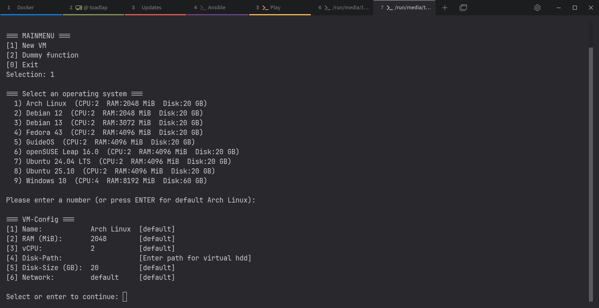

# kvm-configurator
  


**kvm-configurator** creates a **virtual machine** and registers it with qemu. In addition, the definition is saved as an **XML** file.

The program can help you if you don't want to or can't use tools like virt-manager. Or if you don't feel like using commands like this:
```bash
virt-install \
  --name guest1-rhel7 \
  --memory 2048 \
  --vcpus 2 \
  --disk size=8 \
  --cdrom /path/to/rhel7.iso \
  --os-variant rhel7
```
**kvm-configurator** is my first  project that goes beyond just playing around.



## Features
- **Easy**: Assisted creation of virtual machines
- **Automatoin**: Created VMs are automatically registered (not started) and are immediately ready for use
- **Customizable**: Default values can be customized individually via a YAML file
- **Resuse & backup**: Create VM configurations are also saved as XML files

## Running the Application
### Compiled version
Download the two files oslist.yaml and kvm-config_x.x.
Set kvm-config_x.x as an executable file:
```bash
chmod +x kvm-config_x.x
```
and start the program with 
```bash
./kvm-config_x.x
```

### Configuration
#### YAML
You can define default values for disk path and disk size in `oslist.yaml`.
```yaml
defaults: &default_vals               
  disk_path: "/srv/vm-images"
  disksize: 20
```
Using default values looks like this:
```yaml
- name: Arch Linux
    id: archlinux
    cpu: 2
    ram: 2048
    <<: *default_vals
```
You can overwrite the default values for your needs like this:
```yaml
- name: Debian 13
    id: debian13
    cpu: 2
    ram: 3072
    disksize: 20
    disk_path: "$HOME/Downloads"
```
#### Sample XML output
```xml
<domain type="kvm">
  <name>new-machine</name>
  <uuid>1f13456f-87da-4901-ab9e-fc942fe1764f</uuid>
  <metadata>
    <libosinfo:libosinfo xmlns:libosinfo="http://libosinfo.org/xmlns/libvirt/domain/1.0">
      <libosinfo:os id="http://ubuntu.com/ubuntu/20.04"/>
    </libosinfo:libosinfo>
  </metadata>
  <memory>1048576</memory>
  <currentMemory>1048576</currentMemory>
  <vcpu>2</vcpu>
  <os>
    <type arch="x86_64" machine="q35">hvm</type>
    <boot dev="hd"/>
  </os>
  <features>
    <acpi/>
    <apic/>
    <vmport state="off"/>
  </features>
  <cpu mode="host-passthrough"/>
  <clock offset="utc">
    <timer name="rtc" tickpolicy="catchup"/>
    <timer name="pit" tickpolicy="delay"/>
    <timer name="hpet" present="no"/>
  </clock>
  <pm>
    <suspend-to-mem enabled="no"/>
    <suspend-to-disk enabled="no"/>
  </pm>
  <devices>
    <emulator>/usr/bin/qemu-system-x86_64</emulator>
    <disk type="file" device="disk">
      <driver name="qemu" type="qcow2"/>
      <source file="/run/media/vm/QEMU/new-machine.qcow2"/>
      <target dev="vda" bus="virtio"/>
    </disk>
    <controller type="usb" model="qemu-xhci" ports="15"/>
    <controller type="pci" model="pcie-root"/>
    <controller type="pci" model="pcie-root-port"/>
    <interface type="user">
      <mac address="52:54:00:c2:70:03"/>
      <model type="virtio"/>
    </interface>
    <console type="pty"/>
    <channel type="unix">
      <source mode="bind"/>
      <target type="virtio" name="org.qemu.guest_agent.0"/>
    </channel>
    <channel type="spicevmc">
      <target type="virtio" name="com.redhat.spice.0"/>
    </channel>
    <input type="tablet" bus="usb"/>
    <graphics type="spice" port="-1" tlsPort="-1" autoport="yes">
      <image compression="off"/>
    </graphics>
    <sound model="ich9"/>
    <video>
      <model type="virtio"/>
    </video>
    <redirdev bus="usb" type="spicevmc"/>
    <memballoon model="virtio"/>
    <rng model="virtio">
      <backend model="random">/dev/urandom</backend>
    </rng>
  </devices>
</domain>
```

### Tested under
- [x] [Arch Linux](https://archlinux.org/)
- [ ] Debian
- [ ] Fedora
- [x] [GuideOS](https://guideos.de/) (Debian-based)
- [x] [Solus](https://getsol.us/)
- [x] [Ubuntu 25.04 & 25.10](https://ubuntu.com/)

## Release notes
### Version 0.9.3
- Minor improvements
- Check whether `virt-install` is available / installed
### Version 0.9.2
[Changelog / Release notes](https://github.com/mrtoadie/kvm-configurator/releases/tag/v0.9.2)
### Version 0.9.1 - Service release
Some screen outputs are now color-coded.
### Version 0.9
Bug fixes related to the storage location for hard disk images
### Version 0.8.5 - Support for YAML
Operating systems are now read from a YAML file.
The YAML can be easily customized by anyone according to their personal preferences.


## Ideas & Roadmap
- [X] logical, easy-to-understand menu
- [ ] transform into TUI style
- [ ] saving XMLs as templates and reediting
- [ ] more & advanced VM parameters
- [ ] web version for browser usage
